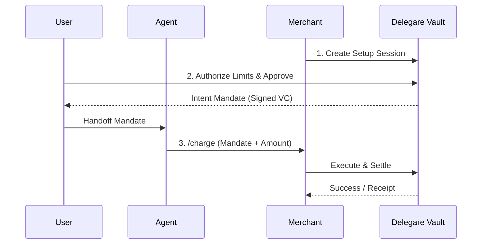

# Delegare

**A payment authorization layer for AI agents.**

Let AI agents pay for things—safely. From ordering pizza to paying for APIs, give agents real spending power with user-defined constraints.

[](https://www.npmjs.com/package/@delegare/sdk)
[](https://opensource.org/licenses/MIT)

---

> **Demo Placeholder:** _(Drop your 60-90 second launch demo GIF/Video here showing the agent requesting an action, the user approving once, and the agent completing the payment)_

---

## 🍕 The "Aha" Moment: Your Agent Orders Dinner

You approve a **$30 food budget** → your agent finds a restaurant → places the order → pays automatically.

## 🔌 The Core Business Case: Autonomous API Payments

Agents increasingly interact with paid services. Delegare lets them seamlessly handle paywalls using our native **x402 protocol** support.

**Example: Your agent hits a paid endpoint → gets a `402 Payment Required` challenge → pays using Delegare → retries automatically.**

---

## ⚙️ How It Works

1. **Setup Session:** Merchant requests a payment session.
2. **Mandate:** User approves the mandate with specific rules.
3. **Charge Mandate:** Agent executes the payment autonomously.



## 🛡️ Built for Trust

People are rightfully skeptical around money. Delegare is built on strict boundaries:

- **Spend Limits:** Atomic server-side counters prevent overspending. If the limit is $10, it cannot spend $10.01.
- **Merchant Allowlists:** Mandates are strictly locked to explicitly approved merchants.
- **Expiration Controls:** Mandates have a strict time-to-live and can be instantly revoked.
- **No Credential Exposure:** Agents hold a signed _Intent Mandate_, never your credit card number or private keys.
- **Dual-Rails:** Settlement via Stripe (Fiat) or Base (Crypto).

---

## 🚀 Get Started in 10 Minutes

Run our Express Checkout example to see both the merchant and agent experience:

1. **Clone & Install**
   ```bash
   git clone https://github.com/delegare/delegare.git
   cd delegare/examples/express-checkout
   pnpm install
   ```
2. **Setup Sandbox**
   Get your test keys from the [Sandbox Dashboard](https://app.sandbox.delegare.dev) and add them to `.env`.
3. **Run the Demo**
   ```bash
   pnpm dev & # Start the mock merchant server
   pnpm setup # Generate a buyer mandate
   ```
   Follow the terminal instructions to approve a test mandate, then execute your first autonomous payment!

---

[Read the Docs](https://docs.delegare.dev) • [Sandbox Dashboard](https://app.sandbox.delegare.dev) • [Discord](https://discord.gg/delegare)

<br/>
<p align="center">
  <small>Built by <a href="https://securelend.ai" target="_blank">SecureLend</a></small>
</p>
