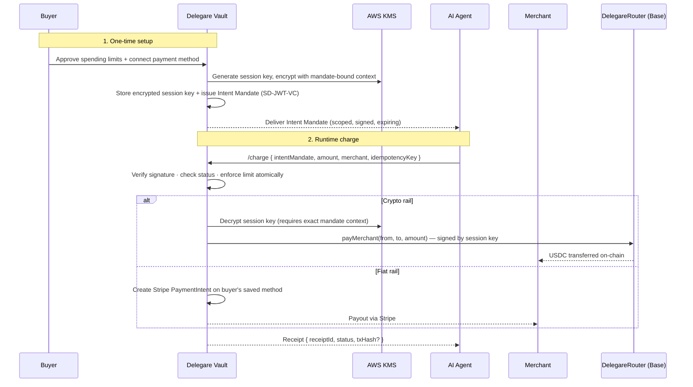

When giving an AI agent economic capabilities, the most critical question is: **"What happens if the agent goes rogue or the merchant is compromised?"**

Delegare's architecture is designed around least privilege, strict enforcement, and zero custody. This page is the reference for exactly what we store, what we don't, and how each component defends against realistic attacks.

## Authorization Flow

The full path from buyer setup to merchant settlement. Every payment traverses the vault, which is where limits are enforced.

## Core Security Principles

### 1. No Credential Sharing
AI models (and the agents running them) are highly susceptible to prompt injection and data leakage. Therefore, **Delegare never exposes credit card numbers, private keys, or seed phrases to the agent.**

The agent only holds an **Intent Mandate** — a cryptographic Verifiable Credential (SD-JWT-VC) that grants tightly scoped permission to spend *up to* a specific limit. See [Intent Mandates](/concepts/intent-mandates) for the anatomy of the credential.

### 2. Session Key Isolation (Crypto Rail)

Each spending mandate gets its own **dedicated ERC-4337 session key** — a unique keypair generated at mandate creation time. This is the only key authorized to initiate payments from the buyer's smart wallet.

**Who holds the session key?**
The private key is **KMS-encrypted** and stored as a ciphertext field on the mandate's own row in DynamoDB. It is:
- **Not accessible to Delegare staff** — decryption requires the exact KMS encryption context bound to that specific `mandateId`; no other context — including broad IAM access — can decrypt it. All KMS calls are audit-logged in CloudTrail.
- **Not accessible to the agent** — the agent only holds the intent mandate (a spending *permission*), never the signing key.
- **Not accessible to the merchant** — the merchant receives USDC directly from the Base blockchain, routed by the on-chain [DelegareRouter](https://sepolia.basescan.org/address/0x85f2afB670E54a3a0F31966F49A18C73ea6a0f62) contract.

The session key can only execute `payMerchant()` calls through the DelegareRouter smart contract, which enforces token whitelisting and payment parameters on-chain. It cannot drain the wallet, transfer arbitrary tokens, or call other contracts.

<Note>
  **Delegare does not custody your funds.** Your USDC stays in your own smart wallet (e.g. Coinbase Smart Wallet). The session key is authorized by *you* during setup to spend from your wallet up to the mandate's limit — the same way you'd authorize a subscription in your bank's app. Delegare provides the infrastructure to route these payments; the blockchain enforces the rules.
</Note>

### 3. Atomic Server-Side Limits
When an agent attempts a charge, the `amountCents` is evaluated against the mandate's remaining limit server-side.
- DynamoDB atomic counters (`UpdateItem` with `ADD`) enforce the budget with zero race conditions.
- An agent cannot send 10 concurrent requests to exhaust a $5 limit multiple times over.
- **Can an agent exceed its limit?** No. The limit is enforced atomically before any payment is initiated.

### 4. Merchant Allowlists
Intent Mandates are bound to a single merchant (via their `merchantId`) or a specific allowlist. If an agent tries to use a mandate authorized for Merchant A at Merchant B, the cryptographic verification fails. The mandate is useless outside its scope.

### 5. Ephemeral and Revokable
- Mandates have strict time-to-live (TTL) expirations. **Default: 1 year; configurable per mandate at setup time.**
- Users can instantly revoke an active mandate via the [Delegare dashboard](https://app.delegare.dev), immediately killing the agent's ability to spend.
- **Revocation wipes the encrypted session key.** Revoked mandates cannot be resurrected — the DynamoDB row is retained for audit but the encrypted private key field is removed on revocation. There is no blocklist to fall out of sync; the key material itself is gone.
- Revocation propagates to both rails atomically and is effective for the next charge (no in-flight window, because every charge re-verifies the mandate at request time).
- Revoking a mandate does not affect your wallet, your other mandates, or past charges.

### 6. Idempotency & Retries
The `/charge` endpoint requires an `idempotencyKey`. If a network timeout occurs, the agent can safely retry with the same key without double-charging.

---

## Threat Model

The defenses above mitigate concrete attacker scenarios. Each row answers "what if?" directly.

| Threat | Blast Radius | What Stops It |
|---|---|---|
| **Agent is prompt-injected** into a large charge | Capped at `maxPerTxCents`; then capped at remaining `maxMonthlySpendCents` | Atomic limit check before any rail is touched |
| **Agent tries to pay a different merchant** | Zero funds moved | Merchant-binding claim in the SD-JWT; signature verification fails |
| **Agent replays an old mandate after revocation** | Zero funds moved | Every charge re-verifies `status`; revoked mandates have no session key to decrypt |
| **Merchant database is breached** and mandate JWTs leak | Only remaining limit on mandates issued to *that* merchant; buyer can revoke | Mandates are merchant-bound; leaked JWT is worthless at any other merchant |
| **Buyer device / browser is compromised** | Attacker can create or revoke mandates; cannot drain the wallet directly | Session keys never touch the device; wallet spending requires a session key Delegare holds under KMS |
| **Stripe webhook is spoofed** | Zero state change | Stripe signature verification + idempotency keys on every update |
| **Delegare employee attempts to drain a buyer wallet** | No access path | KMS decryption requires per-`mandateId` context; broad IAM cannot substitute; all calls in CloudTrail |
| **Delegare infra is fully breached** (hypothetical worst-case) | Attacker can drain session-key balances up to each mandate's remaining limit; cannot drain the buyer's wallet beyond authorized amounts | Router contract caps spend at the on-chain session-key allowance the buyer signed; Stripe rail enforced by Stripe's PCI boundary |
| **Router contract bug** | Bounded by on-chain allowance per session key | Contract is pausable by admin multisig; buyer can revoke the on-chain session key authorization in their wallet |
| **Old charge replayed by a malicious merchant** | Zero duplicate charge | Same `idempotencyKey` returns the existing receipt; no double-settlement |

---

## Data Inventory

What Delegare stores, where, how it's protected, and for how long. The **Never touches Delegare** rows are the important ones.

| Data | Where | Protection | Retention |
|---|---|---|---|
| Card number / CVV | **Never touches Delegare** | Stripe tokenizes in-browser; we only see a Stripe `pm_` reference | N/A |
| Wallet seed phrase | **Never touches Delegare** | Buyer's wallet (e.g. Coinbase Smart Wallet) keeps it | N/A |
| Full wallet private key | **Never touches Delegare** | Buyer signs the session-key authorization once; we never see the wallet key | N/A |
| **Session key (private)** | DynamoDB | KMS envelope encryption, context-bound to `mandateId` — cross-mandate reuse cryptographically impossible | Until mandate revoked or expired; then `REMOVE`d from the row |
| Intent Mandate (SD-JWT-VC) | **Agent-side only** | Buyer controls who holds it; signed by Delegare's Platform DID | Buyer-controlled |
| Stripe customer ID (`cus_…`) | DynamoDB | At-rest (AWS-managed KMS on table) | Until account closed |
| Buyer email | DynamoDB | At-rest | Until account closed |
| Spending-limit state (monthly counter, etc.) | DynamoDB | At-rest | 7 years (tax/compliance) |
| Transaction log (amount, merchant, time, rail) | DynamoDB | At-rest | 7 years (tax/compliance) |
| OAuth access / refresh tokens | DynamoDB | Hashed; TTL-bounded | Short-lived |
| KMS encryption context metadata | CloudTrail | AWS-managed, immutable | 90 days (CloudTrail default) |

**Delegare never sees or stores:** your card number, your CVV, your wallet seed, your wallet's main private key, or your bank credentials. What we hold is enough to route authorized amounts — and nothing more.

---

## What You Trust — And What You Don't

Delegare minimizes trust by building on existing, battle-tested infrastructure rather than asking you to trust a new system:

| Layer | What handles it | Trust basis |
|---|---|---|
| **Fiat payments** | [Stripe](https://stripe.com) | PCI-DSS Level 1, bank-grade fraud detection, established since 2010 |
| **Crypto payments** | [Base](https://base.org) (Coinbase L2) | Open-source EVM chain, secured by Ethereum L1 |
| **Smart contract** | DelegareRouter | On-chain, auditable, enforces token whitelisting and payment routing |
| **Session key storage** | AWS KMS + DynamoDB | KMS envelope encryption; decryption requires mandate-bound context — cross-mandate reuse is cryptographically impossible |
| **Spending limits** | DynamoDB atomic counters | Race-condition-free enforcement, server-side |
| **Transport** | TLS 1.2+ with HSTS | Every API + dashboard hop; certificates managed by AWS ACM |

**Delegare is the infrastructure layer** that abstracts across these systems. It does not hold your funds, does not have access to your full wallet, and does not have the ability to spend beyond what each mandate authorizes.

### What this means in practice

- **You do not trust the agent** with your card or wallet. You trust it with a scoped $10 allowance that auto-expires.
- **You do not trust the merchant** with your payment credentials. The merchant receives USDC on-chain (crypto) or a Stripe charge (fiat) — they never see your card number or private key.
- **You do not trust Delegare with custody.** Your funds stay in your Stripe-linked account or your own smart wallet. Delegare routes authorized amounts using session keys you approved, over infrastructure (Stripe, Base) that exists independently of Delegare.

If a merchant is compromised, the attacker only gains access to the remaining balance on mandates issued to that merchant — not your bank account, not your wallet, not any other mandate.

---

## Business Continuity

A legitimate question for any custody-adjacent service: **what happens if Delegare disappears?**

- **Your wallet stays yours.** The session-key authorization lives on-chain in your own smart wallet. If Delegare vanished tomorrow, the session keys we hold would simply become inert — they can only call `payMerchant()` on the DelegareRouter, and you retain the ability to revoke them directly from your wallet with no Delegare involvement.
- **Your Stripe relationship stays yours.** Stripe customer records and payment methods are held in your merchant's / your own Stripe account. Delegare stores a `pm_` reference, not your card.
- **Mandate records are exportable.** The dashboard exposes a full transaction and mandate history you can download at any time.
- **The DelegareRouter is immutable in its rules.** Token whitelist changes and pauses are multisig-gated; no single operator can redirect funds.

---

## Known Limitations

We believe honesty builds more trust than polish. Where we've chosen a trade-off, here it is:

- **We rely on AWS KMS.** If AWS itself is compromised, our at-rest encryption is only as good as AWS's. We consider this acceptable because the alternative — rolling our own key management — is almost always worse.
- **Fiat payments require us to store a Stripe `pm_` pointer.** This is a reference, not a card number, but it is a piece of data we retain about each buyer. Revoking a mandate and deleting the account removes it.
- **No third-party security audit yet.** A full audit of the vault (application + smart contract) is scheduled for Q3 2026; results will be published here. Until then, treat Delegare as "pre-audit" and use mandate limits that match your risk tolerance.
- **Mainnet DelegareRouter is not yet deployed.** The production launch runs on Base Sepolia with real USDC-bridged testnet flow. Mainnet deploy follows the Q3 audit. The [Sepolia router](https://sepolia.basescan.org/address/0x85f2afB670E54a3a0F31966F49A18C73ea6a0f62) is public and can be read by anyone.
- **Session key gas is funded by Delegare.** The 0.5¢ minimum transaction fee covers gas so neither the buyer nor the merchant pays separately. Abuse protection is rate-based; a compromised mandate could consume some gas stipend, but cannot exceed its spend limits.
- **Revocation is effective for the next charge, not mid-charge.** A charge that has already passed the atomic limit check and reached the rail will complete. In practice this window is sub-second, but it is not zero.

---

## Platform Fee Transparency

Delegare charges a small platform fee per transaction, separate from the underlying rail costs:

| Transaction amount | Delegare fee |
|---|---|
| < $1.00 | 3% of amount |
| ≥ $1.00 | Flat 3 cents |
| Minimum | 0.5 cents (**includes Base gas** — no separate gas pass-through) |

Rail costs for fiat (Stripe acquiring fees) are passed through at cost. On the crypto rail, the 0.5¢ minimum already includes the session key's gas on Base, so merchants and buyers never receive a surprise gas line item.

---

## Reporting a Security Issue

We welcome responsible disclosure.

- **Email:** [security@delegare.dev](mailto:security@delegare.dev)
- **Scope:** the Delegare vault API, the DelegareRouter smart contract, the dashboard, and the `@delegare/*` packages on npm.
- **Out of scope:** denial-of-service on non-production environments, issues already covered in [Known Limitations](#known-limitations), and third-party systems we build on (Stripe, AWS, Base) — please report those to the upstream project.
- **Response:** we acknowledge within 2 business days and aim to resolve or publish a mitigation within 30 days.
- **Bounty:** no formal bounty program yet, but we pay fairly for valid reports and will credit you in the resolution notes if you'd like.

Please **do not** open public GitHub issues for suspected vulnerabilities.
